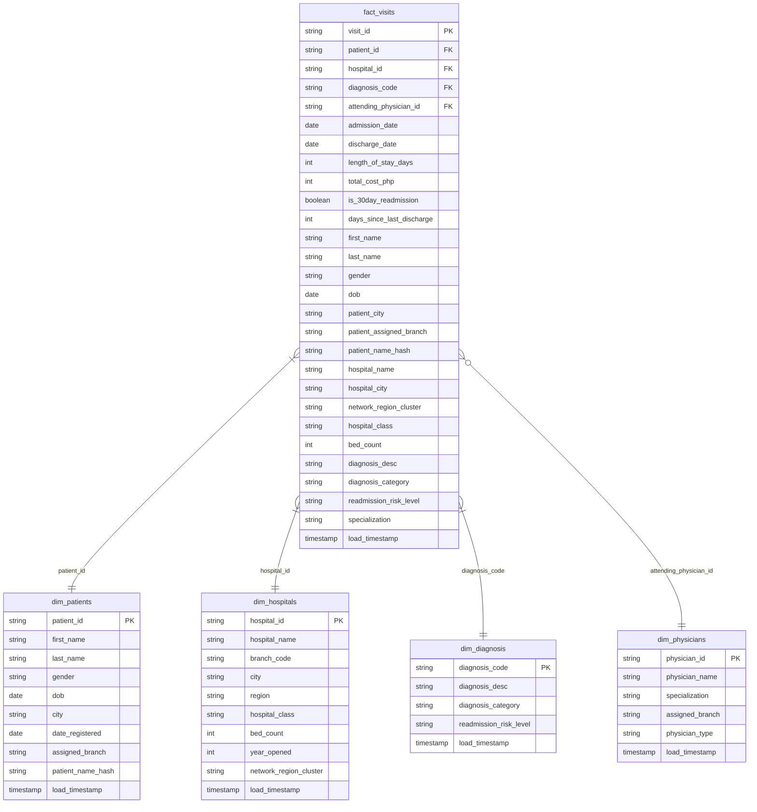

## MediLuzon Health Network — Hospital Readmission Data Pipeline

### Overview
This project builds an **end-to-end data engineering pipeline** for **MediLuzon Health Network**, a fictional private hospital group with 10 branches across the Philippines. Raw hospital data from five source systems is ingested, cleaned, and transformed through a **medallion architecture** on Azure Databricks, producing six Gold KPI tables that answer the network's core question: which branches, diagnoses, and physicians are driving the highest 30-day readmission rates.

The pipeline handles challenges including incremental ingestion with Auto Loader, schema evolution, data cleaning, PII pseudonymization, Delta merge/upsert, and automated deployment via Databricks Asset Bundles and GitHub Actions.

### Data Architecture


**CI/CD flow**

```
Push to dev branch                    Push to main branch
       ↓                                      ↓
GitHub Actions                        GitHub Actions
deploy-dev.yml                        deploy-prod.yml
       ↓                                      ↓
databricks bundle deploy --target dev  databricks bundle deploy --target prod
       ↓                                      ↓
Dev job runs automatically             Prod job triggered manually
                                       after dev run verified
```

**Workflow task dependencies**

```
run_bronze_raw_ingestion
         ↓
dim_diagnosis · dim_hospitals · dim_patients · dim_physicians  (parallel)
         ↓
fact_visits_silver
         ↓
readmission_analysis_gold
```


### Data Sources
Five CSV files simulating exports from MediLuzon's Hospital Information System. 

| File | Description |
|---|---|
| `hospitals_raw.csv` | Hospital branch and cluster data 
| `diagnosis_raw.csv`| Diagnosis data
| `patients_raw.csv` | Patient demographics
| `physicians_raw.csv` | Physician data 
| `visits_raw.csv` | Hospital visits data

### Data Modeling

#### Star Schema

`fact_visits` sits at the center with four surrounding dimension tables.



- Fact Table - Hospital visits
- Dimension Tables - Diagnosis, Patients, Hospitals, Physicians

The Silver fact_visits table uses a denormalized design wherein dimension attributes are pre-joined into the table, simplifying Gold aggregations with no joins required. Dimension tables remain normalized (each attribute stored in one place), and serve as reference tables that provide context for the measures in fact_visits.


### Data Quality Checks

- **Deduplication** - dropping duplicates across all dimension tables
- **Handling of missing and invalid values** - null checks on critical columns 
- **Standardization of formats** - gender format, renaming of columns, date parsing 
- **Validation of referential integrity** - all foreign keys in fact table connect to dimension records

### Key Findings

From 3,000 valid visits across 10 branches:

| KPI | Value |
|---|---|
| Overall 30-day readmission rate | 38.2% |
| Highest branch readmission rate | MediLuzon General Hospital – Davao (41.5%) |
| Lowest branch readmission rate | MediLuzon Community Hospital – Pampanga (35.6%) |
| Top diagnosis by readmission volume | Essential Hypertension — I10 |
| Top diagnosis by readmission rate | Chronic Kidney Disease — N18 (68.0%) |
| High-risk diagnosis readmission rate | 46.2% vs Medium-risk 30.2% |
| Highest specialization readmission rate | Oncology (47.8%) |
| Average length of stay | 5.2 days |
| Average cost per visit | PHP 57,548 |

### Tech Stack
| Component | Tool |
|---|---|
| Cloud Platform | Microsoft Azure |
| Storage | Azure Data Lake Storage Gen2 (ADLS) |
| Compute & Processing | Azure Databricks |
| Table Format | Delta Lake |
| Ingestion | Auto Loader (`cloudFiles`) |
| Language | PySpark (Python) |
| Orchestration | Databricks Workflows |
| Deployment | Databricks Asset Bundles |
| CI/CD | GitHub Actions |
| Version Control | GitHub |
| Catalog | Unity Catalog |

### Deployment

**Databricks Asset Bundles** with two targets:

```yaml
targets:
  dev:
    mode: development
    workspace:
      host: ${DATABRICKS_HOST}

  prod:
    mode: production
    workspace:
      host: ${DATABRICKS_HOST}
```

**GitHub Actions** triggers:
- Push to `dev` → `deploy-dev.yml` → deploys and runs the dev job automatically
- Push to `main` → `deploy-prod.yml` → deploys to prod → prod job triggered manually


###  Next Steps

- **Databricks Genie** — connect Gold KPI tables to Genie for natural language querying and self-serve analytics for the MediLuzon operations team
- **Power BI dashboard** — connect to Databricks SQL endpoint for KPI reporting 
- **Age group analysis** — derive patient age groups from `dob` in `dim_patients` and segment readmission rates by cohort (18–34, 35–54, 55–69, 70+)
- **Pipeline logging** — embed run logging into each notebook layer writing to a `catalog.logging.pipeline_run_log` Delta table for pipeline observability
