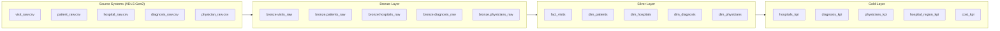

# azure-databricks-healthcare-readmission

```mermaid
flowchart LR
    subgraph Sources["Source Systems (ADLS Gen2)"]
        v[visit_raw.csv]
        p[patient_raw.csv]
        h[hospital_raw.csv]
        d[diagnosis_raw.csv]
        ph[physician_raw.csv]
    end

    subgraph Bronze["Bronze Layer"]
        bv[bronze.visits_raw]
        bp[bronze.patients_raw]
        bh[bronze.hospitals_raw]
        bd[bronze.diagnosis_raw]
        bph[bronze.physicians_raw]
    end

    subgraph Silver["Silver Layer"]
        fv[fact_visits]
        dp[dim_patients]
        dh[dim_hospitals]
        dd[dim_diagnosis]
        dph[dim_physicians]
    end

    subgraph Gold["Gold Layer"]
        g1[hospitals_kpi]
        g2[diagnosis_kpi]
        g3[physicians_kpi]
        g4[hospital_region_kpi]
        g5[cost_kpi]
    end

    Sources --> Bronze
    Bronze --> Silver
    Silver --> Gold
```
